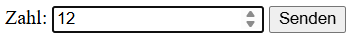
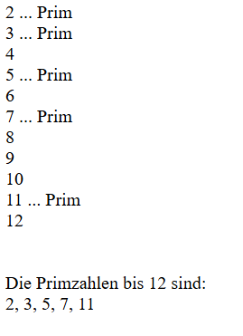
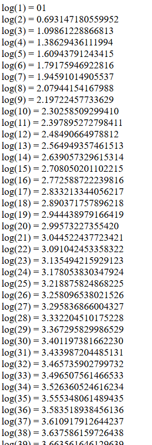

# Primzahlenberechnung
---
- Autor: Ingo Schlapschy
- Schuljahr: 2024/25
- Lehrgang: 2
- Klasse: 3aAPC
- Gruppe: C
- Fach: ITL12
- Datum: 2024-11-21

---
## Angabe
Aufgabenstellung
1. Primzahlenberechnung:
	- Auf einer HTML Seite sind alle Primzahlen von 1 bis zur eingegeben Zahl auszugeben.
	- Tipp: Jede Zahl durch alle Zahlen von 2 bis n/2 dividieren
2. Logarithmus:
	- Ausgabe der Logarithmischen Funktion:
	- Berechne den Log(n) für alle Zahlen von 1 bis 100
	- ~~Gib jeweils Sterne in einer Zeile für jedes Ergebnis aus.~~  

---
### ToDo
- [x] PHP Projekt erstellen
	- [x] eingabe.html
	- [x] ausgabe.php
- [x] Primzahlen
	- [x] Eingabe einer Zahl n
	- [ ] Berechnung der Primzahlen < n
	- [ ] Ausgabe der Primzahlen
- [x] Logarithmus
	- [x] Ausgabe Log(n=1 ->100)
- [ ] Abgeben
## Lösung
### Primzahlen
#### Im Browser


#### index.html
```html
<!DOCTYPE html>
<html>
    <head>
        <title>Die Primzahlen bis</title>
        <meta charset="UTF-8">
        <meta name="viewport" content="width=device-width, initial-scale=1.0">
    </head>
    <body>
        <form action="ausgabe.php" method="post">
            <label>Zahl: <input type="number" name="myNumber"></label>
            <button>Senden</button>
        </form>
    </body>
</html>

```

#### ausgabe.php
```php
<?php

$myNumber = $_POST["myNumber"];
$Primzahlen = "";
if ($myNumber < "2") {
    echo "bitte Zahl >= 2 eingeben";
    
} else {
    $i = 2;
    while ($i<=$myNumber){
        $sqrt_i = sqrt($i);
        $isPrime = 1;
        $j = 2;
        while (($j <= $sqrt_i) AND ($isPrime == 1)){
            if(($i%$j)==0){
                $isPrime = 0;
            }
            $j++;
        }
        if ($isPrime == 1){
            $Primzahlen.=$i.", ";
            echo $i." ... Prim".nl2br("\n");
        } else {
            echo $i.nl2br("\n");
        }
        $i++;
    }
echo nl2br("\n\nDie Primzahlen bis ")
    .$myNumber." sind: ".nl2br("\n")
    .rtrim($Primzahlen,", ");
}

```

### Logarithmus
#### im Browser


#### index.html
```html
<!DOCTYPE html>
<html>
    <head>
        <title>Die Primzahlen bis</title>
        <meta charset="UTF-8">
        <meta name="viewport" content="width=device-width, initial-scale=1.0">
    </head>
    <body>
        <form action="prim.php" method="post">
            <label>Primzahlen bis: <input type="number" name="myNumber"></label>
            <button>Senden</button>
        </form>
        <br/>
        <form action="logarithmus.php" method="post">
            <button>Logarithmus bis 100</button>
        </form>
    </body>
</html>


```
#### logarithmus.php
```php
<?php

$myNumber = 100;

$i=1;
while ($i<=$myNumber) {
    echo "log(".$i.") = ".log($i);
    echo $i.nl2br("\n");
    $i++;
}
```
