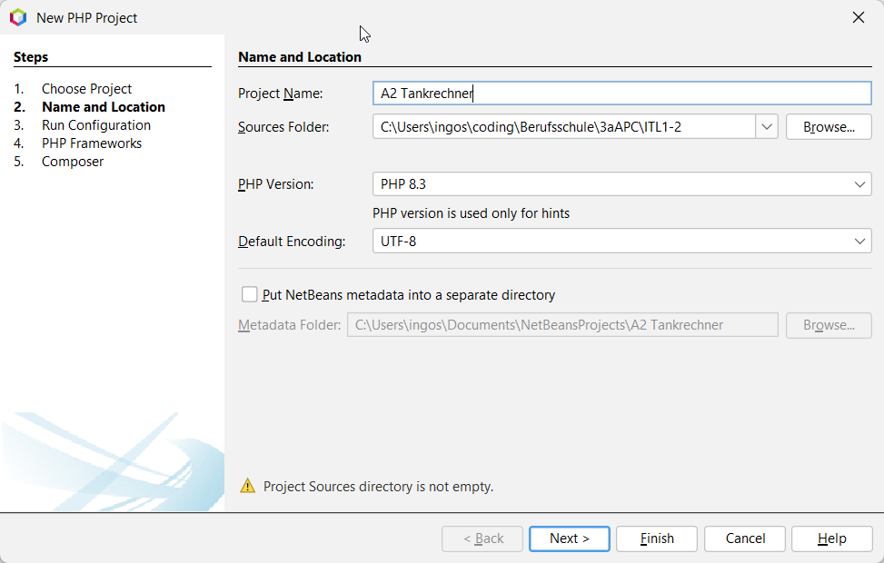
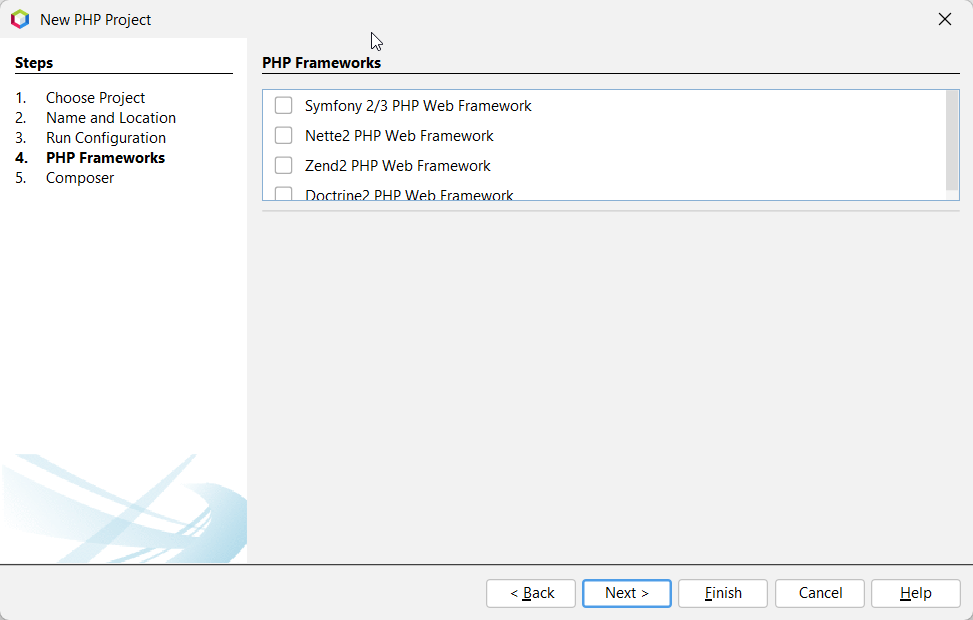
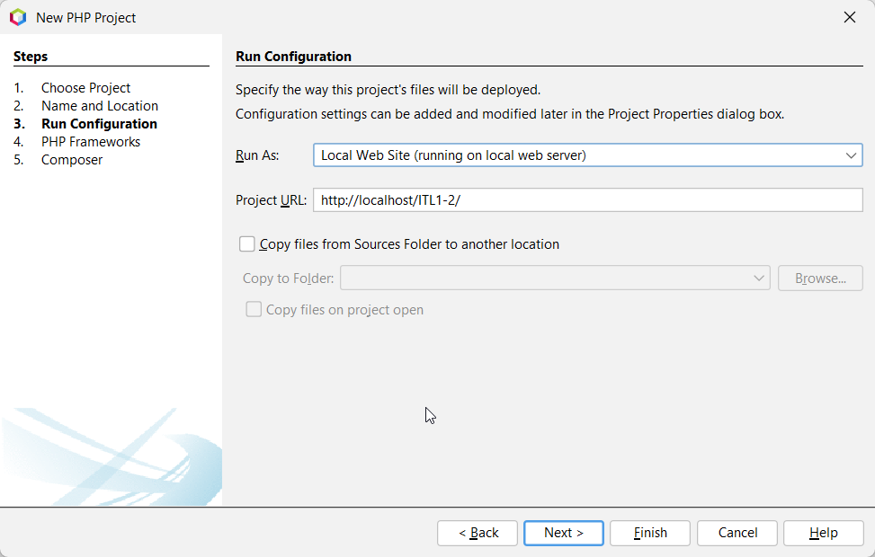
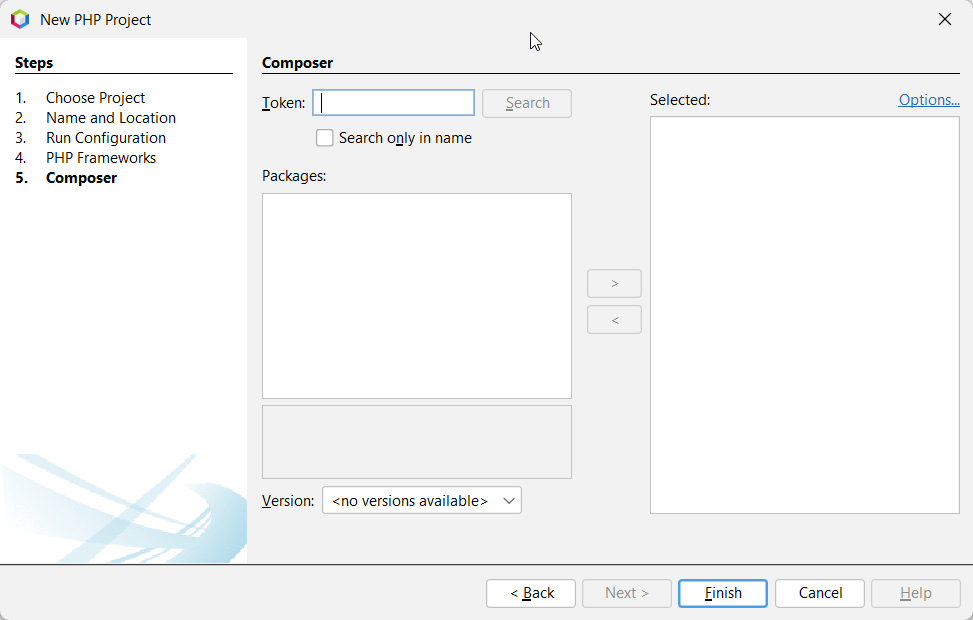
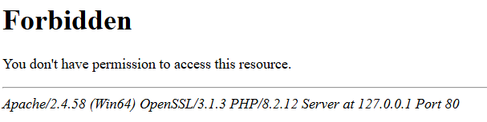
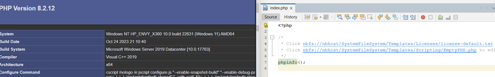

# NameDesThemas
---
- Autor: Ingo Schlapschy
- Schuljahr: 2024/25
- Lehrgang: 2
- Klasse: 3aAPC
- Gruppe: C
- Fach: ITLxx/Informatik
- Datum: 2024-11-19
---
## Angabe

> 1. Aufgabenstellung
> • Welche Informationen liefert die Funktion phpinfo();
> • Wozu dienen folgende Optionen in der PHP.INI:
> 	◦ PHP-Fehler ausgeben
> 	◦ Speichernutzung und die Laufzeit deiner Skripte limitieren
> 	◦ allow_url_fopen = off
> 	◦ safe-mode = on
> 	◦ session.auto_start = off
> Beispielwebseite in PHP: (in eine datei mit Namen test.php in das htdocs Verzeichnis kopieren und testen)
> 
> Alles innerhalb des <?php und ?> (PHP Tag) wird vom Interpreter ausgeführt.
> 
> Variablen:
> Die Aufgabe dieses Programms ist die Addition und Multiplikation mehrerer Zahlen und Anzeige des Rechenergebnisses. (KEINE INTERAKTION MIT BENUTZER – Die Werte stehen in der PHP Datei fix eingetragen)
> Zwei Tankfüllungen (liter1=40.5, liter2=35.7) mit dem gleichen Literpreis (preis=1.499) sind zu multiplizieren und als Kosten (kosten) in einem Aussagesatz anzuzeigen.
> Dafür wird im 1. Teil die Kostenermittlung durchgeführt.
> Im 2. Teil wird bei der Ergebnisanzeige eine Zeichenkette durch Verbindung aus: Der Zeichenkette "Die Benzinkosten betragen für ", der Addition der Variablen liter1 + liter2, der Zeichenkette "Liter ", der Variablen kosten und der Zeichenkette "€" gebildet.
> Das Ergebnis sollte dann so aussehen:
> Die Benzinkosten betragen für 76.2 Liter 114.2238 €
> 
> ERWEITERUNG: Dateneingabemöglichkeiten recherchieren (POST/GET Variablen mittels HTML Formularen)

### ToDo
- [ ] Generelle Infos
	- [ ] phpinfo()
	- [ ] PHP.INI
		- [ ] Fehlerausgabe
		- [ ] Speichernutzung/Laufzeit einstellen
		- [ ] allow_url_fopen = off
		- [ ] safe-mode = on
		- [ ] session.auto_start = off
- [ ] Beispielwebsite in PHP
	- [ ] test.php in htdocs
	- [ ] Rechenoperationen
		- [ ] Addition
		- [ ] Multiplikation
		- [ ] Ausgabe des Ergebnis
	- [x] Beispiel Tankfüllungen
		- [x] tank1=40.5l
		- [x] tank2=35.7l
		- [x] preis = 1.499 €/l
		- [x] Ausgabe "Die Benzinkosten betragen für 76.2 Liter 114.2238 €"
	- [ ] Erweiterung Dateneingabe
		- [ ] POST/GET

- [ ] Abgeben
## Lösung
### Neues Projekt
- Netbeans ->Neues Projekt
	- Ordner auswählen
	- Kein Framework Standard Laufkonfiguration
	- Keine Ahnung was ein Composer ist 
Problem: 
- (Mögliche) Lösung: In xampp-Ordner erstellen: [Setting Up a PHP Project](https://netbeans.apache.org/tutorial/main/kb/docs/php/project-setup/)
- 
### Allgemeines
- phpinfo()
	- Gibt Infos über PHP-Konfiguration
	- [PHP: phpinfo - Manual](https://www.php.net/manual/de/function.phpinfo.php)
	- 
- PHP.INI
### Fehlerausgabe
[PHP: error_reporting - Manual](https://www.php.net/manual/de/function.error-reporting.php)
```php
<?php  
  
// Fehlermeldungen komplett abschalten  
error_reporting(0);  
  
// Nur einfache Fehler melden  
error_reporting(E_ERROR | E_WARNING | E_PARSE);  
  
// E_NOTICE ist sinnvoll, um uninitialisierte oder  
// falsch geschriebene Variablen zu entdecken  
error_reporting(E_ERROR | E_WARNING | E_PARSE | E_NOTICE);  
  
// Melde alle Fehler außer E_NOTICE  
error_reporting(E_ALL & ~E_NOTICE);  
  
// Melde alle PHP-Fehler  
error_reporting(E_ALL);  
  
// Melde alle PHP-Fehler  
error_reporting(-1);  
  
// Dies entspricht error_reporting(E_ALL);  
ini_set('error_reporting', E_ALL);  
  
?>
```
### Beispiel
```php
$tank1 = 40.5;
$tank2 = 35.5;
$preisLiter = 1.499;

$tankGesamt = $tank1 + $tank2;
$kostenGesamt = $preisLiter * $tankGesamt;

echo "Die Bezinkosten betragen für " . $tankGesamt . " Liter " . $kostenGesamt . "€";
```
#### Im Browser


